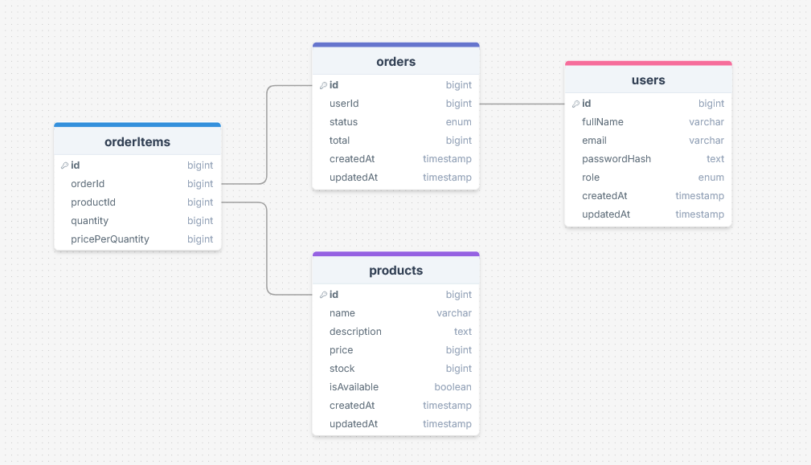

## Database Schema



## Scripts

```json
{
  "scripts": {
    "dev": "next dev",
    "build": "next dev",
    "db:generate": "drizzle-kit generate", // Create SQL files by comparing new and old schemas.
    "db:migrate": "drizzle-kit migrate", // Apply all pending migrations in the DB server.
    "lint": "biome lint --write", // Lint files and apply safe fixes to specific files
    "format": "biome format --write", // Format all files
    "biome": "biome check --write" // Format, lint, and organize imports of all files.
  }
}
```
